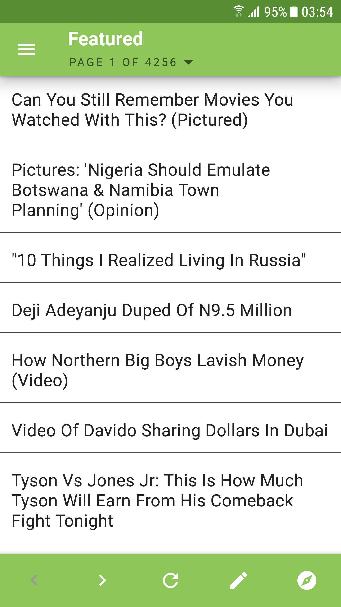
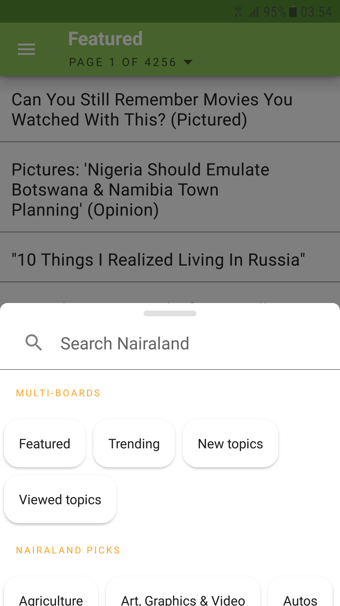
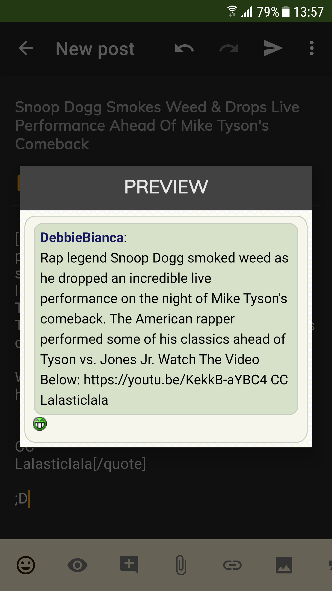

<h2 align="center"><b>Amebo</b></h2>
<h4 align="center">Amebo is an Android client for Nairaland</h4>

### Features

* Read topics, posts, user profiles
* Preview posts before submission
* Multiple accounts
* Send mails
* Like, share & report posts
* Create new topics and posts
* Dark mode

### Todo
* Banned accounts
* Tests
* More themes

### Screenshots

